# ProjectPulse AI — Intelligent Infrastructure Project Monitoring & Early Warning Platform (SIH26103)

## Executive Summary
**ProjectPulse AI** is a complete, production-grade AI-powered infrastructure monitoring and decision-support web platform engineered for **SIH26103: Web-Based Integrated Project-Monitoring Platform**.

The platform is designed not merely as a project-tracking dashboard, but as a proactive, predictive intelligence layer that complements India's existing PAIMANA project monitoring ecosystem.

The core data and intelligence flow:
$$\text{PAIMANA / Project Data} \longrightarrow \text{Data Processing} \longrightarrow \text{AI/ML Risk Engine} \longrightarrow \text{Early Warning Alerts} \longrightarrow \text{Root Cause Analysis} \longrightarrow \text{Interventions} \longrightarrow \text{Officer Action}$$

---

## 1. Core Architecture & Feature Matrix

### A. Machine Learning & Predictive Risk Engine
- **Dual Predictive Model**:
  - **Estimated Delay Probability (0–100%)**: Calibrated Random Forest regression model on schedule slippage, contractor milestones, and clearance bottlenecks.
  - **Cost Overrun Probability (0–100%)**: Calibrated regression model predicting budget escalation risk based on expenditure velocity, progress gap, and statutory hold-ups.
- **Decomposed Health Score (0–100)**: Multi-dimensional health index composed of:
  - Schedule Health
  - Financial Health
  - Physical Progress
  - Milestone Health
  - Statutory Clearance Approvals
- **Explainable AI (XAI)**: Quantifies factor contributions for 7 primary bottleneck indicators and provides an evidence-based narrative explaining why a project is categorized as Critical, High, Medium, or Low risk.
- **What-If Scenario Simulator**: Real-time slider-driven interface permitting officers to adjust physical progress, delay days, cost, and clearance statuses to project dynamic risk mitigation outcomes.

### B. Role-Based Access Control (RBAC) & Object-Level Authorization
The backend enforces strict Role-Based Access Control with 3 primary roles:
1. **Administrator (`admin`)**:
   - Universal project visibility and write access.
   - User account registry, approvals, and administrative user provisioning (`/admin/users`, `POST /admin/users/create`).
   - Tamper-evident Security Audit Log (`/admin/audit-logs`).
   - System settings and CSV bulk data ingestion.
2. **Monitoring Officer (`officer`)**:
   - Scoped strictly to assigned infrastructure projects (`ProjectAssignment`).
   - Triage alerts, update progress, review ML root-cause diagnostics, and execute What-If simulations.
   - Strictly forbidden from administrative governance, account creation, or audit logs (HTTP 403).
3. **Observer / Viewer (`viewer`)**:
   - Read-only minimum disclosure access across public infrastructure projects.
   - Forbidden from project editing, deletion, CSV importing, alert triaging, or administrative console (HTTP 403).

### C. Server-Side Data Minimization & Field-Level Access Control
Following the core security mandate:
> **«NEVER send unwanted, sensitive, internal, or unauthorized data to the user's browser in the first place.»**

No sensitive data is ever delivered to unauthorized clients and concealed with CSS (`display:none`) or hidden form fields. If a user is not authorized to see a field, the backend strips it using a strict **Default-Deny** whitelist:
- **Viewer**: Receives summary project metrics, progress percentage, approved/revised costs, and public alert summaries. Private officer notes, bottleneck indicators, internal triggers, and ML feature weights are omitted.
- **Officer**: Receives operational diagnostics, clearance statuses, contractor status, milestones, and Risk DNA for assigned projects.
- **Absolute Secrets**: Passwords, hashes, verification tokens, reset tokens, and session secrets are **NEVER EXPOSED TO ANY USER**.

---

## 2. User Creation & Authentication Workflows

The platform supports a robust **Dual-Path User Provisioning System**:

```mermaid
flowchart TD
    subgraph Self-Service Registration
        A[Visitor on /register] --> B[Enter Name, Org, Email, Role, Password]
        B --> C[Validate Password Strength & Unique Identity]
        C --> D[Create Account in pending_verification State]
        D --> E[Dispatch 24h Time-Limited Verification Link]
        E --> F{User Clicks Verification Link}
        F -->|Viewer| G[Mark Email Verified & Activate Account]
        F -->|Officer| H[Mark Email Verified & Set pending_approval]
        H --> I[Admin Reviews & Approves Account via Admin Console]
        I --> J[Account Activated - Officer Signs In]
        G --> K[Account Activated - Viewer Signs In]
    end

    subgraph Administrative User Provisioning
        L[Admin in /admin/users] --> M[Click '+ Create New User']
        M --> N[Fill Modal: Name, Username, Email, Role, Password]
        N --> O{Direct Activation Checkbox}
        O -->|Checked| P[Create Account with email_verified=True & status=active]
        O -->|Unchecked| Q[Create Account & Dispatch Verification Email]
        P --> R[Assign Specific Infrastructure Projects for Officers]
        R --> S[Account Immediately Ready for Sign-in]
    end
```



### Self-Service Registration (`/register`)
- Available for **Monitoring Officer** and **Observer / Viewer** roles (Administrative self-registration is strictly prohibited).
- Password complexity enforcement: $\ge 8$ characters, mixed case, numbers, and special symbols.
- Unverified accounts cannot authenticate; rate-limited resend option is provided.

### Administrative User Provisioning (`/admin/users`)
- Administrators can directly create and provision accounts for any role (`admin`, `officer`, `viewer`).
- Allows **Direct Activation** (instant onboarding without email delay) or standard verification dispatch.
- Automatically assigns selected infrastructure projects to Monitoring Officers.

---

## 3. Verification & Validation Summary

### Automated Test Suite Execution (56/56 Tests Passing)
```text
Ran 56 tests in 44.941s

OK
- tests/test_data_minimization.py: 9 passed
- tests/test_rbac_and_object_auth.py: 11 passed
- tests/test_auth.py: 12 passed (including Direct Activation & Admin Provisioning)
- tests/test_security.py: 9 passed
- tests/test_api.py: 4 passed
- tests/test_projects.py: 4 passed
- tests/test_alerts.py: 3 passed
- tests/test_risk.py: 4 passed
```

### 15-Point Enterprise Security Audit (`scratch/test_live_security_upgrade.py`)
- [x] **Database & Verified Accounts**: OK
- [x] **CSRF Protection Rejection (Missing Token $\to$ 400)**: OK
- [x] **Login with Valid CSRF Token**: OK
- [x] **Security Headers (CSP, Frame-Options, Content-Type, Referrer)**: OK
- [x] **Session Cookie Security Configuration (HttpOnly, SameSite=Lax)**: OK
- [x] **Anonymous Route Protection (Redirect to Login)**: OK
- [x] **Role-Based Access Control (Viewer/Officer restricted with 403 Forbidden)**: OK
- [x] **Administrator Access to Governance & Audit Logs**: OK
- [x] **Direct Sensitive File Access Blocked (.env, .db, .sqlite, .bak)**: OK
- [x] **API Projects Pagination & Anti-Exfiltration 100 Limit Hard Cap**: OK
- [x] **Safe CSV Export Endpoint**: OK
- [x] **AI Assistant Sensitive Keyword Guardrail**: OK
- [x] **What-If Simulator Bounds Validation & Calculation**: OK
- [x] **Password Change Workflow & 4-Point Complexity**: OK
- [x] **Tamper-Evident Security Audit Trail (Zero Credential Leakage)**: OK

---

## 4. Standard User Accounts for Evaluation

| User Role | Username | Password | Purpose / Scope |
| :--- | :--- | :--- | :--- |
| **Administrator** | `admin` | `admin123` | Complete platform control, user provisioning, audit logs, CSV data import. |
| **Monitoring Officer** | `officer` | `officer123` | Operational metrics, bottleneck indicators, milestone updates, alert triage for assigned projects. |
| **Observer / Viewer** | `viewer` | `viewer123` | High-level status inspection, macro indicators, and read-only transparency. |
